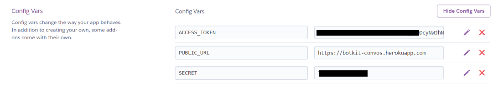

# GVE_Devnet_WebexTeamsBot_MessageForwader: forward message to space

This project implements one subset of the Botkit + Webex Teams adapter bot project, based on the DevNet [botkit-template](https://www.github.com/CiscoDevNet/botkit-template) project.

- `forward.js`- Forwards a Webex teams message sent directly to the bot who's access token is configured in the `WEBEX_ACCESS_TOKEN` environment variable to the Webex Teams Space with ID specified in the `TEST_ROOM` environment variable.  The Bot must be a member that Space to be able to send messages into it. 

The `forward.js` script is automatically loaded when the node `bot.js` script is executed and focuses on implementing functionality once a direct message is received by the bot. You can learn more about how add functionality to the bot implemented in this sample, including how to add Natural Language Processing (NLP) and simple ways to respond to commands by looking at the full [botkit documentation](https://botkit.ai/docs/v4/)  

But if you just want to add destinations to the message to be re-sent, change the way the bot replies with it receives the message and perhaps make changes/additions to what is sent along with the forwarding you should be able to do that all within the function implemented in `forward.js`

## Websockets vs. Webhooks

Most Botkit features can be implemented by using the Webex Teams JS SDK websockets functionality, which establishes a persistent connection to the Webex Teams cloud for outbound and inbound messages/events.

Webex Teams also supports traditional HTTP webhooks for messages/events, which requires that your bot be accessible via a publically reachable URL.  A public URL is also needed if your bot will be serving any web pages/files, e.g. images associated with the cards and buttons feature or the health check URL.

- If you don't need to serve buttons and cards images, you can set the environment variable `WEBSOCKET_EVENTS=True` and avoid the need for a public URL
- If you are implementing buttons & cards, you will need a public URL (e.g. by using a service like Ngrok, or hosting your bot in the cloud) - configure this via the `PUBLIC_URL` environment variable 

For this particular example, we will use the Webex Teams JS SDK websockets functionality.

## How to run (local machine)


1. Clone this repo:

    ```sh
    git clone https://wwwin-github.cisco.com/gve/GVE_Devnet_WebexTeamsBot_MessageForwader.git

    cd GVE_Devnet_WebexTeamsBot_MessageForwader
    ```

1. Install the Node.js dependencies (https://github.com/CiscoDevNet/GVE_Devnet_WebexTeamsBot_MessageForwader):

    ```sh
    npm install
    ```
 

   ``` npm install ---save webex```  

1. Create a Webex Teams bot account at ['Webex for Developers'](https://developer.webex.com/my-apps/new/bot), and note/save your bot's access token

1. Add the newly created bot to a Webex Teams Room (Space) where you intent to forward messages.


1. Edit the sample `.env` file provided to specify the bot's access token you obtained in the step above as the value to assign to the `WEBEX_ACCESS_TOKEN` environment variable and also the Room ID of the Room where you will forward the messages in the `TEST_ROOM` environment variable. You can obtain the Room ID using the List Rooms REST API call at: https://developer.webex.com/docs/api/v1/rooms/list-rooms . Just unselect the "Use personal access token" option in the Authorization section on that page and use the Bot acess token to obtain a list of Rooms the bot belongs to. 


1. You're ready to run your bot:

    ```sh
    node bot.js
    ```

 

The following explains how to install the script in Glitch or Heroku and is NOT required to enable the "forward" script. 
## Quick start on Glitch.me

* Click [](https://glitch.com/edit/#!/import/github/CiscoDevNet/botkit-template)

* Open the `.env` file, then uncomment the `WEBEX_ACCESS_TOKEN` variable and paste in your bot's access token

    **Optional**: enter appropriate info in the "Bot meta info..." section

    >Note that thanks to Glitch `PROJECT_DOMAIN` env variable, you do not need to add a `PUBLIC_URL` variable pointing to your app domain

You bot is all set, responding in 1-1 and 'group' spaces, and sending a welcome message when added to a space!

You can verify the bot is up and running by browsing to its healthcheck URL (i.e. the app domain.)

## Quick start on Heroku

* Create a new project pointing to this repo.

* Open your app settings, view your config variables, and add a `WEBEX_ACCESS_TOKEN` variable with your bot's access token as value.

* Unless your app is using [Dyno Metadata](https://devcenter.heroku.com/articles/dyno-metadata), you also need to add a PUBLIC_URL variable pointing to your app domain.



You bot is all set, responding in 1-1 and 'group' spaces, and sending a welcome message when added to a space!

You can verify the bot is up and running by browsing to its healthcheck URL (i.e. the app domain.)

### LICENSE

Provided under Cisco Sample Code License, for details see [LICENSE](LICENSE.md)

### CODE_OF_CONDUCT

Our code of conduct is available [here](CODE_OF_CONDUCT.md)

### CONTRIBUTING

See our contributing guidelines [here](CONTRIBUTING.md)

#### DISCLAIMER:
<b>Please note:</b> This script is meant for demo purposes only. All tools/ scripts in this repo are released for use "AS IS" without any warranties of any kind, including, but not limited to their installation, use, or performance. Any use of these scripts and tools is at your own risk. There is no guarantee that they have been through thorough testing in a comparable environment and we are not responsible for any damage or data loss incurred with their use.
You are responsible for reviewing and testing any scripts you run thoroughly before use in any non-testing environment.